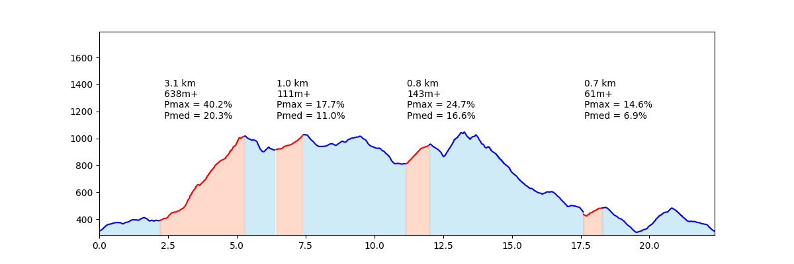
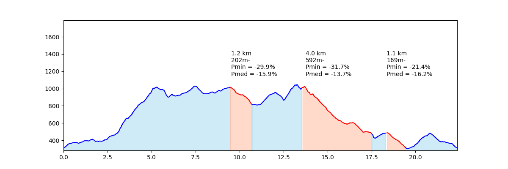

# Análisis de Recorridos Outdoor

## Descripción

**Análisis de Recorridos Outdoor** es un proyecto diseñado para satisfacer la necesidad de evaluar la dureza de recorridos al aire libre mediante el análisis de sus perfiles. Utiliza técnicas de análisis de datos GIS para obtener métricas relevantes del recorrido. El programa procesa datos de rutas y genera un informe detallado en formato PDF, que incluye gráficas agrupadas con métricas relevantes para entornos deportivos tanto competitivos como lúdicos, de especial utilidad en senderismo, trail running o mountain bike. 

## Características

- Carga de datos de recorridos en distintos formatos.
- Análisis de métricas como desnivel, pendiente, distancia y tiempo.
- Generación de gráficos ilustrativos del recorrido.
- Exportación de resultados en un informe PDF.

## Muestra

A continuación, se muestra un ejemplo de los resultados generados por el programa. En este caso se trata del análisis realizado de cara a la competición Trencacims, en su distancia de 24 kilómetros con 1800 metros de desnivel positivo. Fue Campeonato de España de Carreras por Montaña 2024 por la Federación Española de Deportes de Montaña y Escalada.

## Estado del Proyecto

Este proyecto se encuentra en una versión de prueba. Gran parte de su funcionalidad está aún pendiente de desarrollo:
- Análisis de tecnicidad basado en histórico de tiempos de Strava.
- Estimación de tiempos para entornos competitivos.
- Interfaz de usuario completa y accesible, que permita al usuario generar un briefing completo del recorrido, añadiendo descripciones en forma de párrafos de texto o fotografías. Esta funcionalidad permitirá la elaboración de briefings de alto nivel para eventos regionales y nacionales de todo tipo.

